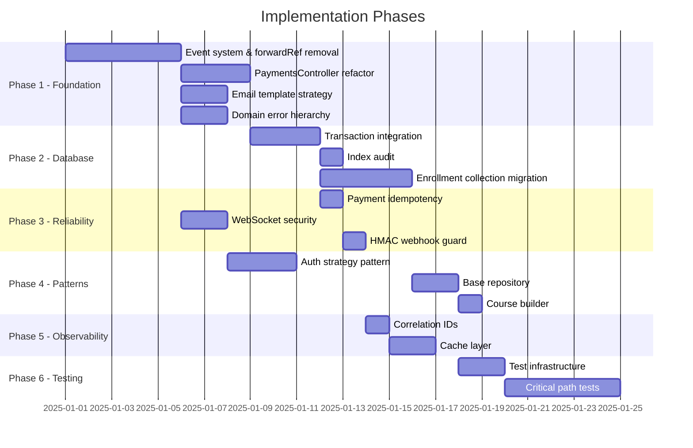

# Backend Engineering Improvement Plan — Academix 2.0

> **Scope**: `nest-server` · NestJS + MongoDB + Mongoose
> **Goal**: Transform a working SaaS backend into a production-grade, architecturally sound system while consciously applying CS/SE principles at every step.

---

## Executive Summary

| Area | Current State | Target State |
|---|---|---|
| Module coupling | 17+ `forwardRef()` calls | Event-driven decoupling |
| Business logic location | Leaked into controllers (`PaymentsController`) | Strict service-layer ownership |
| Data consistency | No transactions used despite `DatabaseService` existing | Transactions on all multi-doc writes |
| Idempotency | None on webhooks/payments | Idempotency keys on all mutating endpoints |
| Email service | 800-line monolith with inline HTML | Template strategy pattern |
| Error handling | Generic catch-all filter | Domain-specific error hierarchy |
| Testing | Zero test files found | Unit + integration coverage on critical paths |
| Observability | Basic Winston logging | Structured logs + correlation IDs |

---

## Phase 1 — Foundation & SOLID Cleanup

### 1.1 Eliminate `forwardRef` Circular Dependencies

**Principle**: Dependency Inversion (SOLID-D), Acyclic Dependencies Principle

**Problem**: 17+ `forwardRef()` usages across modules create a tangled dependency graph.

**Current violations** (file → injected dependency):
- `payments.module.ts` → Cart, Courses, Discount, Invoice, Users (5 forwardRefs)
- `organizations.module.ts` → Users, Courses (2 forwardRefs)
- `courses.module.ts` → Payments, Users (2 forwardRefs)
- `discount.module.ts` → Courses (1 forwardRef)
- `cart.module.ts` → Courses (1 forwardRef)
- `level.module.ts` → Organizations (1 forwardRef)
- Plus service-level injections in controllers/services

**Solution**: Introduce a `SharedDataAccessModule` that exports all repositories, and use NestJS `EventEmitter2` for cross-module side effects.

```
// BEFORE (circular):
PaymentsModule → CoursesModule → PaymentsModule

// AFTER (acyclic):
PaymentsModule → SharedDataAccessModule
CoursesModule  → SharedDataAccessModule
PaymentsModule  --event--> CoursesModule (via EventEmitter)
```

**Tasks**:
1. Create `src/shared/shared-data-access.module.ts` exporting all repositories
2. Create `src/shared/events/` directory with typed event classes
3. Install `@nestjs/event-emitter` and register in `AppModule`
4. Refactor `PaymentsController.handleWebhook` to emit events instead of calling services directly
5. Remove all `forwardRef()` calls one module at a time

**Files to modify**: `app.module.ts`, all `*.module.ts` files, `payments.controller.ts`

---

### 1.2 Extract Business Logic from `PaymentsController`

**Principle**: Single Responsibility (SOLID-S), Command Pattern

**Problem**: `payments.controller.ts` (518 lines) contains enrollment logic, cart clearing, invoice creation, and discount validation — all inside controller methods.

**Current code** (`PaymentsController.handleWebhook`, lines ~200-400):
```typescript
// Controller directly does:
// 1. Verify HMAC
// 2. Process webhook
// 3. Enroll user in courses  ← business logic leak
// 4. Clear cart              ← business logic leak
// 5. Create invoice          ← business logic leak
// 6. Increment discount usage ← business logic leak
```

**Solution**: Create a `PaymentOrchestrationService` using the **Mediator Pattern**:

```typescript
// src/modules/payments/payment-orchestration.service.ts
@Injectable()
export class PaymentOrchestrationService {
  constructor(
    private readonly eventEmitter: EventEmitter2,
    private readonly paymentsService: PaymentsService,
  ) {}

  async handleSuccessfulPayment(payment: PaymentDocument): Promise<void> {
    // Emit domain event — listeners handle side effects
    this.eventEmitter.emit('payment.success', new PaymentSuccessEvent({
      paymentId: payment._id,
      userId: payment.userId,
      courseIds: payment.courseIds,
      isCartPayment: payment.isCartPayment,
      discountCodeId: payment.discountCodeId,
    }));
  }
}
```

**Event listeners** (decoupled modules):
| Event | Listener | Module |
|---|---|---|
| `payment.success` | `EnrollmentListener.onPaymentSuccess()` | Courses |
| `payment.success` | `CartCleanupListener.onPaymentSuccess()` | Cart |
| `payment.success` | `InvoiceListener.onPaymentSuccess()` | Invoice |
| `payment.success` | `DiscountUsageListener.onPaymentSuccess()` | Discount |

**Files to create**: `payment-orchestration.service.ts`, `src/shared/events/payment.events.ts`, 4 listener files  
**Files to modify**: `payments.controller.ts`, `payments.module.ts`

---

### 1.3 Fix the Email Template Monolith

**Principle**: Open/Closed (SOLID-O), Strategy Pattern

**Problem**: `brevo.service.ts` is 805 lines. ~700 lines are duplicated HTML templates with only color/text differences.

**Solution**: Extract templates using Strategy Pattern:

```typescript
// src/modules/email/templates/email-template.strategy.ts
export interface EmailTemplateStrategy {
  getSubject(): string;
  getHtmlContent(code: string): string;
  getTextContent(code: string): string;
}

// src/modules/email/templates/email-verification.template.ts
export class EmailVerificationTemplate implements EmailTemplateStrategy {
  private readonly config = {
    gradient: ['#667eea', '#764ba2'],
    emoji: '🎓',
    title: 'Welcome to Academix!',
    subtitle: 'Verify your email to get started',
    // ...
  };
  // Uses a shared base template renderer
}
```

**Files to create**: `email-template.strategy.ts`, `base-template.renderer.ts`, 4 template classes  
**Files to modify**: `brevo.service.ts` (reduce from 805 → ~80 lines)

---

### 1.4 Domain Error Hierarchy

**Principle**: Liskov Substitution (SOLID-L), Exception Hierarchy

**Problem**: Business errors use generic NestJS exceptions (`BadRequestException`, `NotFoundException`) with string messages. No distinction between domain errors and infrastructure errors.

**Solution**:

```typescript
// src/shared/errors/domain.errors.ts
export abstract class DomainError extends Error {
  abstract readonly code: string;
  abstract readonly httpStatus: number;
}

export class PaymentAmountMismatchError extends DomainError {
  readonly code = 'PAYMENT_AMOUNT_MISMATCH';
  readonly httpStatus = 400;
  constructor(expected: number, actual: number) {
    super(`Expected ${expected} cents, received ${actual} cents`);
  }
}

export class OtpExpiredError extends DomainError {
  readonly code = 'OTP_EXPIRED';
  readonly httpStatus = 400;
}

export class MembershipNotFoundError extends DomainError {
  readonly code = 'MEMBERSHIP_NOT_FOUND';
  readonly httpStatus = 403;
}
```

Update `AllExceptionsFilter` to handle `DomainError` subclasses with structured JSON responses including the `code` field.

**Files to create**: `src/shared/errors/domain.errors.ts`, `src/shared/errors/payment.errors.ts`, `src/shared/errors/auth.errors.ts`  
**Files to modify**: `all-exceptions.filter.ts`, services that throw errors

---

## Phase 2 — Database Engineering

### 2.1 Use Existing `DatabaseService` for Transactions

**Principle**: Atomicity (ACID), Unit of Work Pattern

**Problem**: `DatabaseService.withTransaction()` exists but is **never called anywhere**. Meanwhile, `OrganizationsService.remove()` performs 8+ sequential writes without atomicity:

```typescript
// organizations.service.ts lines ~350-500 (current)
await this.membershipRepository.deleteMany({...});
await this.roleRepository.deleteMany({...});
await this.coursesService.archiveByOrganization(id);
await this.levelRepository.deleteMany({...});
await this.termRepository.deleteMany({...});
// If any of these fail, data is left in an inconsistent state
```

**Solution**: Wrap cascade operations in transactions:

```typescript
async remove(id: string, userId: string): Promise<void> {
  await this.databaseService.withTransaction(async (session) => {
    await this.membershipRepository.deleteMany({ organizationId: id }, { session });
    await this.roleRepository.deleteMany({ organizationId: id }, { session });
    await this.coursesService.archiveByOrganization(id, session);
    await this.organizationsRepository.softDelete(id, userId, session);
  });
}
```

> [!IMPORTANT]
> MongoDB transactions require a **replica set**. Ensure your development MongoDB runs as a replica set (`rs.initiate()`), or use MongoDB Atlas which provides this by default.

**Critical operations that MUST use transactions**:
| Operation | File | Risk without transaction |
|---|---|---|
| Organization deletion cascade | `organizations.service.ts:remove()` | Orphaned courses, memberships |
| Payment webhook processing | `payments.service.ts:processWebhook()` | Double enrollment, lost payments |
| User enrollment + payment update | `payments.controller.ts:handleWebhook()` | Paid but not enrolled |
| Discount usage increment + payment | `discount.service.ts` | Discount over-used |

**Files to modify**: `organizations.service.ts`, `payments.service.ts`, all repository methods (add optional `session` param)

---

### 2.2 Index Audit & Optimization

**Principle**: Query Optimization, Covering Indexes

**Current state**: Good foundation with indexes defined in schemas. Issues found:

| Schema | Issue | Fix |
|---|---|---|
| `Payment` | `isCartPayment: 1` standalone index is low-selectivity (boolean) | Remove — already covered by compound `{ userId: 1, isCartPayment: 1 }` |
| `Payment` | Missing index for webhook lookup | Add `{ paymobOrderId: 1 }` as **unique sparse** |
| `OrganizationMembership` | 9 indexes on a single collection — potential write overhead | Audit with `db.collection.aggregate([{$indexStats:{}}])` and remove unused |
| `Course` | `students` is an unbounded array with ObjectId refs | Migrate to a separate `Enrollment` collection (see 2.3) |
| `User` | `purchasedCourses` is an unbounded array | Derive from `Payment` aggregation instead of storing |
| `Chat` | No index on `{ type: 1, participants: 1 }` for filtered queries | Add compound index |

**Tasks**:
1. Run `db.collection.aggregate([{$indexStats:{}}])` on all collections in production
2. Remove redundant single-field indexes covered by compounds
3. Add missing compound indexes from table above
4. Document index rationale in each schema file

---

### 2.3 Refactor Unbounded Arrays

**Principle**: MongoDB Schema Design Anti-Pattern Avoidance

**Problem**: `Course.students` is a `Types.ObjectId[]` that grows unboundedly. A course with 10,000 students creates a massive document that:
- Exceeds the 16MB document limit eventually
- Makes every read of the course expensive
- Causes write contention on enrollment

**Solution**: Create a dedicated `Enrollment` collection:

```typescript
// src/modules/enrollments/schemas/enrollment.schema.ts
@Schema({ timestamps: true, collection: 'enrollments' })
export class Enrollment {
  @Prop({ type: Types.ObjectId, ref: 'User', required: true })
  userId: Types.ObjectId;

  @Prop({ type: Types.ObjectId, ref: 'Course', required: true })
  courseId: Types.ObjectId;

  @Prop({ type: Types.ObjectId, ref: 'Payment' })
  paymentId?: Types.ObjectId;

  @Prop({ type: String, enum: ['active', 'expired', 'refunded'], default: 'active' })
  status: string;

  @Prop({ type: Number, default: 0 })
  progressPercent: number;
}

// Indexes
EnrollmentSchema.index({ userId: 1, courseId: 1 }, { unique: true });
EnrollmentSchema.index({ courseId: 1, status: 1 });
EnrollmentSchema.index({ userId: 1, status: 1 });
```

Similarly, remove `User.purchasedCourses` and derive it from enrollments/payments.

**Files to create**: `src/modules/enrollments/` (full module)  
**Files to modify**: `course.schema.ts`, `user.schema.ts`, `courses.service.ts`, `payments.controller.ts`

---

## Phase 3 — Reliability & Security

### 3.1 Payment Idempotency

**Principle**: Idempotency, At-Least-Once Delivery Safety

**Problem**: `processWebhook()` has no idempotency check. Paymob can (and will) send duplicate webhook notifications. Current code will re-process payments.

**Solution**:

```typescript
// In payments.service.ts:processWebhook()
async processWebhook(webhookData: any): Promise<void> {
  const transactionId = webhookData.obj.id.toString();

  // Idempotency: check if already processed
  const existing = await this.paymentsRepository.findOne({
    paymobTransactionId: transactionId,
    status: { $in: [PaymentStatus.SUCCESS, PaymentStatus.FAILED] },
  });

  if (existing) {
    this.logger.log(`Webhook already processed for transaction: ${transactionId}`);
    return; // Idempotent — no-op
  }

  // ... proceed with processing
}
```

Add unique index: `PaymentSchema.index({ paymobTransactionId: 1 }, { unique: true, sparse: true })`

---

### 3.2 WebSocket Security Hardening

**Principle**: Defense in Depth, Principle of Least Privilege

**Problems in `chat.gateway.ts`**:

| Line | Issue | Fix |
|---|---|---|
| 17 | `origin: '*'` allows any origin | Use `ConfigService` for allowed origins |
| 27 | `userSockets: Map<string, string>` is single-socket per user | Use `Map<string, Set<string>>` for multi-device |
| 46 | `jwtService.verify(token)` uses default secret — may differ from HTTP auth | Share the same `ConfigService.get('app.jwt.secret')` |
| 159 | `join-chat` has no authorization check | Verify user is a participant before joining |
| 83-103 | `private-message` handler is a placeholder with no persistence | Implement or remove |

**Solution**: Create a `WsAuthGuard` and `WsRateLimiter`:

```typescript
// src/common/guards/ws-auth.guard.ts
@Injectable()
export class WsAuthGuard implements CanActivate {
  canActivate(context: ExecutionContext): boolean {
    const client = context.switchToWs().getClient<Socket>();
    return !!client.data.userId; // Set during handleConnection
  }
}
```

---

### 3.3 HMAC Verification for Webhooks

**Problem**: The webhook handler in `payments.controller.ts` should verify the Paymob HMAC signature to prevent forged webhooks.

**Solution**: Create a `WebhookGuard`:

```typescript
@Injectable()
export class PaymobHmacGuard implements CanActivate {
  constructor(private configService: ConfigService) {}

  canActivate(context: ExecutionContext): boolean {
    const request = context.switchToHttp().getRequest();
    const hmacSecret = this.configService.get('app.paymob.hmacSecret');
    const receivedHmac = request.query.hmac || request.headers['x-paymob-hmac'];

    const calculatedHmac = crypto
      .createHmac('sha512', hmacSecret)
      .update(this.buildHmacString(request.body))
      .digest('hex');

    return crypto.timingSafeEqual(
      Buffer.from(receivedHmac),
      Buffer.from(calculatedHmac),
    );
  }
}
```

---

## Phase 4 — Design Patterns Application

### 4.1 Strategy Pattern: Auth Login Flow

**File**: `auth.service.ts` (527 lines)

**Problem**: `login()` method has complex branching for 2FA, email verification, account status, and OAuth — all in one method.

**Solution**: Auth Strategy per flow:

```typescript
// src/modules/auth/strategies/
export interface LoginStrategy {
  supports(context: LoginContext): boolean;
  execute(context: LoginContext): Promise<LoginResult>;
}

@Injectable()
export class TwoFactorLoginStrategy implements LoginStrategy {
  supports(ctx: LoginContext): boolean {
    return ctx.user.twoFactorEnabled && !ctx.otpCode;
  }
  async execute(ctx: LoginContext): Promise<LoginResult> {
    await this.otpService.generateOtp(ctx.user.email, OtpPurpose.TWO_FACTOR_AUTH);
    return { requiresTwoFactor: true };
  }
}

@Injectable()
export class StandardLoginStrategy implements LoginStrategy { /* ... */ }

@Injectable()
export class OAuthLoginStrategy implements LoginStrategy { /* ... */ }
```

The `AuthService.login()` becomes a simple loop:
```typescript
for (const strategy of this.loginStrategies) {
  if (strategy.supports(context)) {
    return strategy.execute(context);
  }
}
```

---

### 4.2 Repository Base Class (Template Method Pattern)

**Problem**: All 10+ repositories repeat identical CRUD boilerplate.

**Solution**: Generic `BaseRepository<T>`:

```typescript
// src/shared/base.repository.ts
export abstract class BaseRepository<T extends Document> {
  constructor(protected readonly model: Model<T>) {}

  async create(data: Partial<T>, session?: ClientSession): Promise<T> {
    const [doc] = await this.model.create([data], { session });
    return doc;
  }

  async findById(id: string, options?: QueryOptions): Promise<T | null> {
    let query = this.model.findById(id);
    if (options?.populate) query = query.populate(options.populate);
    return query.lean().exec();
  }

  async findOne(filter: FilterQuery<T>, session?: ClientSession): Promise<T | null> {
    return this.model.findOne(filter).session(session).lean().exec();
  }

  // ... update, delete, count, etc.
}
```

Every repository becomes:
```typescript
@Injectable()
export class UsersRepository extends BaseRepository<UserDocument> {
  constructor(@InjectModel(User.name) model: Model<UserDocument>) {
    super(model);
  }
  // Only domain-specific methods here
}
```

---

### 4.3 Builder Pattern: Course Creation

**Problem**: `CoursesService.create()` has conditional defaults for organization courses scattered in if-statements.

**Solution**:
```typescript
export class CourseBuilder {
  private course: Partial<Course> = {};

  forOrganization(orgId: string): this {
    this.course.organizationId = orgId;
    this.course.courseType = CourseType.ORGANIZATION;
    this.course.enrollmentType = EnrollmentType.ORG_SUBSCRIPTION;
    this.course.isOrgPrivate = true;
    this.course.price = 0;
    return this;
  }

  forFreelancing(): this {
    this.course.courseType = CourseType.FREELANCING;
    return this;
  }

  withInstructor(id: string): this { this.course.instructor = id; return this; }
  build(): Partial<Course> { return { ...this.course }; }
}
```

---

## Phase 5 — Observability & Caching

### 5.1 Correlation ID Middleware

```typescript
// src/common/middleware/correlation-id.middleware.ts
@Injectable()
export class CorrelationIdMiddleware implements NestMiddleware {
  use(req: Request, res: Response, next: NextFunction) {
    const correlationId = req.headers['x-correlation-id'] || randomUUID();
    req['correlationId'] = correlationId;
    res.setHeader('x-correlation-id', correlationId);
    next();
  }
}
```

Integrate with Winston so every log line includes the correlation ID.

### 5.2 Cache Layer (Decorator Pattern)

**Priority targets** for in-memory caching (`@nestjs/cache-manager`):
| Data | TTL | Invalidation Trigger |
|---|---|---|
| `OrganizationRole` permissions | 5 min | Role update |
| Course listing (public, paginated) | 2 min | Course publish/update |
| User's active memberships | 1 min | Membership change |

---

## Phase 6 — Testing Strategy

### 6.1 Priority Test Targets

| Priority | Module | Test Type | Why |
|---|---|---|---|
| 🔴 Critical | `PaymentsService.processWebhook` | Unit + Integration | Money flow — must not double-charge |
| 🔴 Critical | `OtpService.verifyOtp` | Unit | Security gate — brute force protection |
| 🟠 High | `OrganizationsService.remove` | Integration | Cascade consistency |
| 🟠 High | `DiscountService.validateDiscount` | Unit | Financial calculation accuracy |
| 🟡 Medium | `AuthService.login` | Unit | Complex branching logic |
| 🟡 Medium | `OrganizationPermissionGuard` | Unit | Authorization correctness |

### 6.2 Test Infrastructure

```typescript
// test/helpers/test-database.module.ts
// Use @nestjs/mongoose with MongoMemoryReplSet for transaction-capable tests

// test/factories/user.factory.ts
export const createTestUser = (overrides?: Partial<User>): User => ({
  name: 'Test User',
  email: `test-${randomUUID()}@example.com`,
  role: UserRole.STUDENT,
  ...overrides,
});
```

---

## Implementation Roadmap



---

## Quick Wins (Do First)

These can be done immediately with minimal risk:

1. **Remove duplicate `DiscountModule`** import in `app.module.ts` (line 62)
2. **Add idempotency check** to `processWebhook()` — 5 lines of code
3. **Restrict WebSocket CORS** — change `origin: '*'` to use `ConfigService`
4. **Remove dead code**: `User.purchasedCourses` comment block (lines 48-50)
5. **Add `{ lean: true }`** to read-only repository queries for 2-5x speedup
6. **Type the `any` usages**: `ChatService.create(createChatDto: any)` → proper DTOs

---

## CS Concepts Mapping

| Concept | Where Applied | Phase |
|---|---|---|
| **SOLID - S** (Single Responsibility) | PaymentsController → orchestration service | 1 |
| **SOLID - O** (Open/Closed) | Email templates via Strategy | 1 |
| **SOLID - L** (Liskov Substitution) | Domain error hierarchy | 1 |
| **SOLID - I** (Interface Segregation) | `EmailTemplateStrategy` interface | 1 |
| **SOLID - D** (Dependency Inversion) | SharedDataAccessModule, events | 1 |
| **Strategy Pattern** | Auth login, email templates | 1, 4 |
| **Mediator Pattern** | PaymentOrchestrationService | 1 |
| **Observer Pattern** | EventEmitter domain events | 1 |
| **Template Method** | BaseRepository | 4 |
| **Builder Pattern** | CourseBuilder | 4 |
| **Decorator Pattern** | Cache layer | 5 |
| **ACID Transactions** | DatabaseService.withTransaction | 2 |
| **Idempotency** | Webhook deduplication | 3 |
| **Covering Indexes** | Index audit & optimization | 2 |
| **Data Normalization** | Enrollment collection extraction | 2 |
| **Defense in Depth** | WsAuthGuard, HMAC guard | 3 |
| **Correlation** | Request tracing middleware | 5 |
